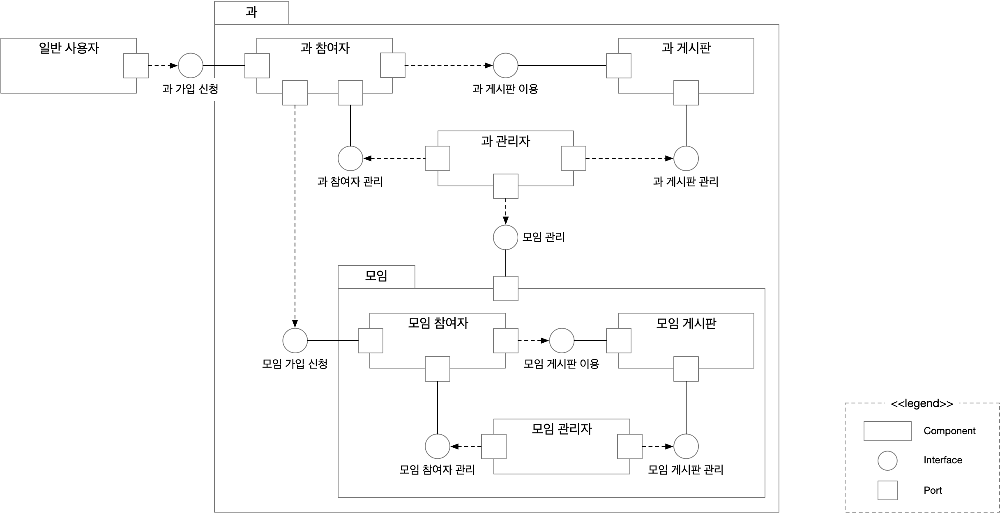

# My-community 기능 문서

본 문서는 My-community의 기능 명세에 대한 문서로 내용은 다음과 같다.

[1.소프트웨어 아키텍처](#소프트웨어-아키텍처)
[2. 회원](#회원)
[3. 모임](#모임)
[4. 게시판](#게시판)
[5. 푸시](#푸시)

## 소프트웨어 아키텍처

###  컴포넌트 다이어그램

My-community는 `과` 단위로 구성되는 서비스로 `과` 내에 `모임`을 생성하여 그룹화된 서비스를 사용할 수 있다.

My-community의 모든 사용자는 본 어플리케이션의 계정을 생성하여 서비스를 이용할 수 있다. 가입한 모든 사용자는 `일반 사용자`가 된다. My-community의 서비스를 이용하여 학과 커뮤니티를 만들고 싶은 관리자는 개인 계정 생성 후 '과 관리자 신청'을 통해 `과`를 생성할 수 있다.

`일반 사용자`는 생성된 `과`에 가입 신청을 할 수 있으며 신청이 승인되면 `과 참여자`가 된다. `과 참여자`는 `과 게시판`를 이용하거나 `모임`에 가입 신청할 수 있다. `과 게시판`는 `과`에 가입된 모든 사용자가 이용할 수 있는 게시판에 대한 컴포넌트다. `모임`은 `과 관리자`에 의해 생성되는 컴포넌트로 과 내 단체를 위한 기능을 제공한다. '과 관리자 신청'을 통해 `과`를 생성한 사용자는 `과 관리자`가 된다. `과 관리자`는 `과 참여자 관리`, `과 게시판 관리`, `모임 관리` 기능을 수행할 수 있다.

`모임`을 생성한 `과 관리자`는 `모임 관리자` 권한을 부여할 수 있다. `모임 관리자`는 `모임 참여자 관리`, `모임 게시판 관리` 기능을 수행할 수 있다. `모임 게시판`는 `모임`에 가입된 사용자가 이용할 수 있는 게시판에 대한 컴포넌트다.

`과 관리자`와 `모임 관리자`는 인터페이스를 통해 각 권한에 맞는 관리 기능을 수행할 수 있다.

## 회원

### 권한

- 개발자
- 과 관리자
- 모임 관리자
- 모임 참여자
- 일반 사용자 (재학생, 졸업생 등)

#### 과 관리자

- 권한 획득 방법
  - 개발자에게 이메일로 신청
  - 이전 과 관리자로부터 권한 이전 (이전 과 관리자는 권한 삭제)
- 역할
  - 일반 사용자 가입 승인 및 퇴출
  - 모임 생성 및 삭제
  - 모임 관리자 권한 부여 및 삭제
  - 과 게시판 관리
    - 과 게시판 생성, 삭제 및 관리 가능
    - 특정 사용자에게 특정 게시판에 대한 권한 부여 가능
    - 특정 사용자가 다수의 게시판에 대한 권한 소유 가능
  - 소속 사용자들에게 푸시 알림 전송
    - 특정 사용자에게 권한 부여 가능
- 특징
  - 가입되어 있지 않은 모임 열람 불가

#### 모임 관리자

- 권한 획득 방법
  - 과 관리자가 일반 사용자 중 직접 지정
  - 이전 모임 관리자로부터 권한 이전 (이전 모임 관리자는 권한 삭제)
- 역할
  - 모임 참여자 가입 승인 및 퇴출
  - 해당 모임 게시판 열람 가능
  - 모임 게시판 관리
    - 모임 게시판 생성, 삭제 및 관리 가능
    - 특정 모임 참여자에게 특정 게시판에 대한 권한 부여 가능
    - 특정 사용자가 다수의 게시판에 대한 권한 소유 가능
  - 소속 모임의 참여자들에게 푸시 알림 전송
    - 특정 모임 참여자에게 권한 부여 가능
- 특징
  - 권한 중복 허용 가능 (ex. 모임1과 모임2는 관리자가 동일할 수 있다.)
  - 과 관리자가 모임 관리자일 수 있음

#### 모임 참여자

- 권한 획득 방법
  - 모임 관리자의 가입 승인
- 역할
  - 가입된 모임의 사용자
  - 가입된 모임의 게시판 열람
- 특징
  - 가입된 모임 탈퇴 가능
  - 여러 모임 중복 가입 가능
  - 과 관리자가 모임 참여자일 수 있음
  - 모임 참여자는 일반 사용자일 수 있음

#### 일반 사용자 (재학생, 졸업생 등)

- 권한 획득 방법
  - 과 관리자의 가입 승인
- 역할
  - 주요 사용자
  - 소속 과의 게시판 열람 가능
  - 소속 과의 모임 검색 및 모임 신청
- 특징
  - 소속 과 탈퇴 가능
  - 모임 관리자와 과 관리자 또한 일반 사용자로 취급할 수 있음

### 회원가입

My-community 서비스 이용은 서비스에 가입한 회원들만 이용할 수 있다.

#### 일반 사용자 가입
0. my-community 앱에서 가입 신청
1. 로그인에 필요한 기본 정보를 입력하여 가입

#### 과 관리자 신청
0. my-community 앱의 일반 사용자는 과 관리자 신청 가능
1. my-community 앱은 과 관리자 신청에 대한 정보를 안내
2. 학교 + 학과, 연락처 등의 정보를 앱 화면에 출력된 개발자 메일로 전송
3. 전달한 연락처로 과 관리자 신청 승인 여부를 전달
4. 신청이 승인되면 과 관리자 권한을 갖고 과를 개설

### 과 참여하기
0. 일반 사용자는 학교 + 학과 정보로 과를 검색
1. 이름, 학번, 기타 정보, 첨부파일 (최대 3개) 등의 정보를 입력하여 과 참여 신청
2. 과 관리자는 과 참여 신청자에 대한 승인 여부 결정
3. 신청 승인 후, 과 참여자가 되어 과 기능 이용 가능

### 개인 관리
#### 일반 사용자
- 회원 정보 변경
- 회원 탈퇴
#### 과 참여자
- 내 작성글 보기
- 내 댓글 보기
- 내 모임 보기
	- 모임 목록 보기
	- 모임 탈퇴
- 푸시 알림 관리
	- 푸시 목록 보기
	- 모임/게시판별 푸시 알림 설정
- 메인 페이지 개인화
- 과 탈퇴

## 모임
모임은 다음으로 구성된다.
- 모임 이름
- 모임 관리자
- 모임 게시판
- 모임 참여자

### 모임 개설
모임 개설은 과 관리자를 통해 할 수 있다.
***TODO: 방법과 필요한 정보 등에 대한 논의 필요***

### 모임 참여 신청
과 참여자는 모임 참여에 대한 신청을 할 수 있다. 모임 관리자가 승인하면 모임을 이용할 수 있다.

## 게시판

과 혹은 모임은 여러 게시판을 가질 수 있다.

### 게시판 종류
#### 일반 게시판
제목과 내용이 존재하는 일반적인 형태의 게시판이다.
- 사진 혹은 첨부 파일을 포함하는 일반 글 작성 가능
- 게시글에 대한 댓글 및 좋아요 기능
	- 대댓글까지 허용
	- 댓글 좋아요 가능
- 익명 옵션 설정 가능
	- 모든 게시글이 익명 처리
	- 게시글의 모든 댓글이 익명 처리

#### 공지 게시판
관리자만 작성할 수 있는 게시판이다.
- 3종류의 글 작성 가능
	- 사진 혹은 첨부 파일을 포함하는 일반 글 작성 가능
	- 하나의 질문에 대한 항목을 선택하는 투표 글 작성 가능
		- 응답에 대한 집계
	- 여러 질문에 대한 응답을 입력하는 신청 글 작성 가능
		- 질문에 대한 응답으로 항목 선택 혹은 텍스트 입력 가능
- 익명 옵션 설정 가능
	- 모든 응답이 익명 처리
	- 게시글의 모든 댓글이 익명 처리
- 일반 글에 대한 댓글 및 좋아요 기능
	- 대댓글까지 허용
	- 댓글 좋아요 가능
***TODO: 투표나 신청 글에도 댓글&좋아요 가능한지 논의 필요***

#### 사진 게시판
사진 게시글을 격자 형태로 나열하는 게시판이다. 게시글은 한 장 이상의 사진과 하나의 글로 구성된다.
- 게시글의 첫번째 사진이 격자 피드에서 출력
- 게시글 클릭 시 상세 페이지로 이동
- 게시글에 대한 댓글 및 좋아요 기능
	- 대댓글까지 허용
	- 댓글 좋아요 가능

#### 달력 게시판
관리자만 작성할 수 있는 달력 형태의 게시판이다.
- 날짜 클릭시 링크 이동 기능 (future)

#### 사물함 게시판 (future)
사물함을 관리할 수 있는 게시판이다.
- 관리자 화면
  - 페이지 (건물 층) 추가
  - 페이지 설정
    - 사물함 개수 및 번호 설정
  - 사용자 할당
    - 기간 설정
- 사용자 화면

### 기본 제공 게시판
과 혹은 모임을 개설하면 기본적으로 제공되는 게시판이다.

| 게시판 이름 | 게시판 종류 |
| ----------- | ----------- |
| 공지사항    | 공지 게시판 |
| 자유 게시판 | 일반 게시판 |
| 사진 게시판 | 사진 게시판 |
| 행사 일정   | 달력 게시판 |

## 푸시
### 과 참여자 & 모임 참여자
- 내 작성글에 댓글이 달렸을 때
- 대댓글이 달렸을 때
- 게시판마다 새글알람 설정
### 모임 관리자
- 모임 관리자는 소속 모임원들에게 푸시 알람 전송 가능
- 모임 신청이 왔을 때
### 과 관리자
- 과 관리자는 과 소속 전체 회원들에게 푸시 알람 전송 가능
- 과 가입 신청이 왔을 때
